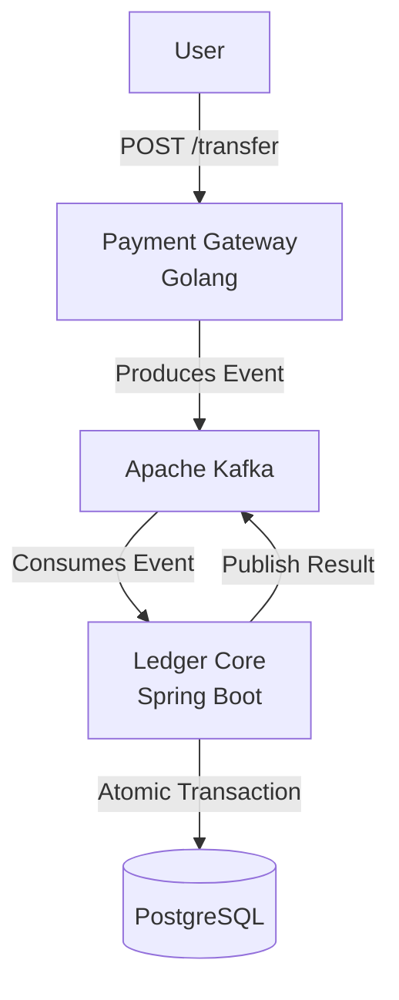
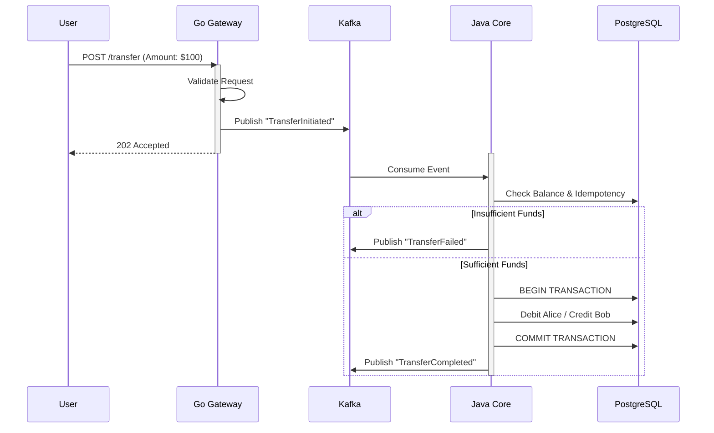

# LedgerFlow 💸

> A high-performance, event-driven distributed ledger system for financial transactions.


-ED8B00?style=flat&logo=openjdk)


## 📖 Overview

LedgerFlow is a banking backend that handles money transfers between accounts. Unlike simple CRUD applications, it uses an **Event-Driven Architecture** to decouple the high-throughput ingestion layer from the transactional core.

It solves critical FinTech challenges:
- **Double-Spending:** Prevented via Idempotency keys.
- **Data Integrity:** Ensured via Double-Entry Bookkeeping (ACID).
- **Resiliency:** Handled via Asynchronous Messaging (Kafka) and Retry Patterns.

## 🏗 System Architecture

The system follows the **CQRS** (Command Query Responsibility Segregation) pattern principles.



### Components

**Payment Gateway (Golang):**
- Acts as the entry point (REST API).
- Validates requests and pushes events to Kafka.
- Designed for high concurrency and low latency.

**Message Broker (Apache Kafka):**
- Buffers requests to handle traffic spikes.
- Decouples the services.

**Ledger Core (Spring Boot 3 + Java 21):**
- Consumes events from Kafka.
- Manages the PostgreSQL database.
- Executes atomic transactions (Debit Sender → Credit Receiver).

## 🔄 Data Flow (Sequence)

How a transaction moves through the system:



## 🛠 Tech Stack

| Component | Technology | Reason |
|-----------|-----------|--------|
| Ingestion Service | Golang (Gin) | Low memory footprint, high concurrency for handling API spikes. |
| Core Service | Java 21 (Spring Boot) | Robust ecosystem for complex transaction management (JPA/Hibernate). |
| Messaging | Apache Kafka | Durable event streaming and decoupling. |
| Database | PostgreSQL | ACID compliance for financial data. |
| Infrastructure | Docker Compose | Orchestration of the multi-container environment. |

## 🚀 Getting Started

### Prerequisites

- Docker & Docker Compose
- Curl (for testing)

### Installation & Running

**1. Clone the repository**

```bash
git clone https://github.com/yourusername/ledger-flow.git
cd ledger-flow
```

**2. Start the System**

This command builds the Go and Java images and starts Kafka, Zookeeper, and Postgres.

```bash
docker compose up --build -d
```

**3. Verify Status**

Ensure all containers are healthy:

```bash
docker ps
```

## 🧪 Testing the API

The system automatically seeds two test accounts on startup:
- `ACC_ALICE` (Balance: $1000)
- `ACC_BOB` (Balance: $0)

### 1. Initiate a Transfer ($100 from Alice to Bob)

```bash
curl -X POST http://localhost:8081/api/v1/transfer \
  -H "Content-Type: application/json" \
  -d '{
    "idempotency_key": "tx-unique-001",
    "source_account": "ACC_ALICE",
    "target_account": "ACC_BOB",
    "amount": 100.00,
    "currency": "USD"
  }'
```

### 2. Check Transaction Status (Database)

```bash
docker exec -it ledger_postgres psql -U ledger_user -d ledger_db -c "SELECT * FROM transactions;"
```

### 3. View Kafka Messages

Open your browser and navigate to the Kafka UI:
```
http://localhost:8080
```

## 🛡 Design Decisions

### Why Hybrid (Go + Java)?

I utilized Go for the gateway to leverage its goroutines for handling thousands of concurrent connections efficiently. Java/Spring Boot was chosen for the core ledger because of its mature ORM (Hibernate) and transaction management capabilities, which are critical for ensuring financial correctness.

### Handling Failures

- **Retry Mechanism:** The Go producer implements exponential backoff if Kafka is unavailable.
- **Idempotency:** The Ledger Core checks `reference_id` before processing to prevent duplicate transactions if messages are delivered twice.

## 🔮 Future Improvements

- Implement Distributed Tracing (Jaeger/OpenTelemetry).
- Add Kubernetes (Helm Charts) for cloud deployment.